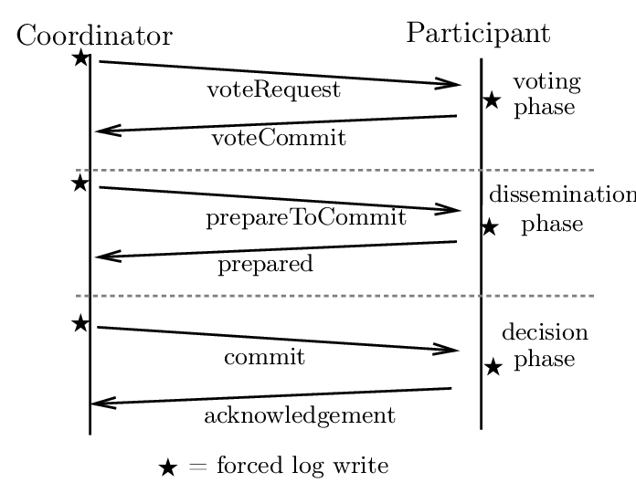

.. include:: substitutions.rst

|DistAlgName|
=========================================

Background and Related Work
~~~~~~~~~~~~~~~~~~~~~~~~~~~~~~

A problem with the two-phase commit protocol is that when the coordinator has
crashed, participants may not be able to reach a final decision. Consequently,
participants may need to remain blocked until the coordinator recovers. [Skeen1981]_
developed a variant of 2PC, called the three-phase commit protocol (3PC),
that avoids blocking processes in the presence of fail-stop crashes. Although 3PC
is widely referred to in the literature, it is not applied often in practice, as the
conditions under which 2PC blocks rarely occur. We discuss the protocol, as
it provides further insight into solving fault-tolerance problems in distributed
systems.

Distributed Algorithm: |DistAlgName| 
~~~~~~~~~~~~~~~~~~~~~~~~~~~~~~~~~~~~~~~~~~~~~~~~~~~~~~~~~~~~~~~~~~~~~~~~~~~~~~~~~~~~~~~~~~~~~~~~~~~~~~~

A key component of distributed systems is the three-phase commit protocol (3PC) :ref:`Algorithm <3PCProtocol>`, which coordinates transactions among several nodes to guarantee atomicity and consistency. Its importance originates from its capacity to consistently coordinate distributed transactions, which prevents inconsistencies and maintains data integrity. This section explores into each aspect of the three-phase commit protocol, clarifying its underlying concepts and practical details. We explore the specifics of its implementation and how it enables distributed participants to make coordinated decisions. In addition, we perform a comparative study, examining the advantages and disadvantages of the three-phase commit protocol in different distributed system scenarios. We learn more about this investigation’s effectiveness in maintaining transactional integrity and its suitability for use in a variety of distributed computing environments.

1. Voting Phase
    a. The coordinator sends a prepare-request message to all participants.

    b. Upon receiving the prepare-request message, each participant checks its readiness to commit the transaction. If ready, it replies with a prepare-commit message; otherwise, it replies with a prepare-abort message.

2. Prepare To Commit Phase
    a. Once the coordinator receives all prepare messages from the participants, it proceeds to the commit phase.

    b. The coordinator sends a commit-request message to all participants if all participants have sent a prepare-commit message. Otherwise, it sends an abort-request message to all participants.

    c. Upon receiving a commit-request message, each participant ensures it is still able to commit the transaction. If so, it replies with a commit message; otherwise, it replies with an abort message.

3. Decision Phase
    a. After receiving all commit/abort messages from participants, the coordinator makes the final decision.

    b. If all participants have replied with a commit message, the coordinator sends a global-commit message to all participants. Otherwise, it sends a global-abort message.

    c. Upon receiving a global-commit message, each participant commits the transaction locally. If a global-abort message is received, each participant aborts the transaction locally.

    .. _3PCProtocol:

    .. code-block:: RST
        :linenos:
        :caption: Three-Phase Commit Protocol Algorithm

        class Coordinator:
            def run(self):
                yetToReceive = list(self.participants)
                self.log.info('WAIT')
                self.chan.sendTo(self.participants, VOTE_REQUEST)

                # Phase 1: Collect votes
                votes = []
                while len(yetToReceive) > 0:
                    msg = self.chan.recvFrom(self.participants, BLOCK, TIMEOUT)
                    if msg == -1 or (msg[1] == VOTE_ABORT):
                        self.log.info('ABORT')
                        self.chan.sendTo(self.participants, GLOBAL_ABORT)
                        return
                    else: # msg[1] == VOTE_COMMIT
                        yetToReceive.remove(msg[0])
                        votes.append(msg[1])
                        self.log.info('RECEIVED VOTE')

                # Phase 2: Decide
                if all(vote == VOTE_COMMIT for vote in votes):
                    decision = GLOBAL_COMMIT
                else:
                    decision = GLOBAL_ABORT

                # Phase 3: Notify participants
                self.log.info('DECISION: ' + decision)
                self.chan.sendTo(self.participants, decision)

        class Participant:
            def run(self):
                self.log.info('INIT')
                msg = self.chan.recvFrom(self.coordinator, BLOCK, TIMEOUT)

                if msg == -1: # Crashed coordinator - give up entirely
                    decision = LOCAL_ABORT
                else: # Coordinator will have sent VOTE_REQUEST
                    decision = self.do_work()

                if decision == LOCAL_ABORT:
                    self.chan.sendTo(self.coordinator, VOTE_ABORT)
                    self.log.info('LOCAL_ABORT')
                else: # Ready to commit, enter READY state
                    self.log.info('READY')
                    self.chan.sendTo(self.coordinator, VOTE_COMMIT)

                msg = self.chan.recvFrom(self.coordinator, BLOCK, TIMEOUT)

                if msg == -1: # Crashed coordinator - check the others
                    self.log.info('NEED_DECISION')
                    self.chan.sendTo(self.participants, NEED_DECISION)

                    while True:
                        msg = self.chan.recvFromAny()
                        if msg[1] in [GLOBAL_COMMIT, GLOBAL_ABORT, LOCAL_ABORT]:
                            decision = msg[1]
                            break
                        else: # Coordinator came to a decision
                            decision = msg[1]

                if decision == GLOBAL_COMMIT:
                    self.log.info('COMMIT')
                else: # decision in [GLOBAL_ABORT, LOCAL_ABORT]:
                    self.log.info('ABORT')

                # Help any other participant when coordinator crashed
                while True:
                    msg = self.chan.recvFrom(self.participants)
                    if msg[1] == NEED_DECISION:
                        self.chan.sendTo([msg[0]], decision)

Example
~~~~~~~~

Correctness
~~~~~~~~~~~

The Three-Phase Commit (3PC) protocol is a distributed algorithm used to ensure atomicity in distributed transactions. It ensures that all participating nodes either commit or abort a transaction in a distributed environment. Here's a brief overview of the correctness, safety, liveness, and fairness proofs for the Three-Phase Commit protocol:

1. **Correctness:**

    The correctness of the Three-Phase Commit protocol guarantees that if all nodes are functioning correctly, the protocol ensures atomicity of distributed transactions.

    Proof:
        The protocol ensures that all nodes reach a consistent decision regarding the outcome of a transaction, i.e., either commit or abort.

        By enforcing a three-phase commit process, the protocol ensures that no committed transaction is lost or left in an inconsistent state.

2. **Safety:**

    Safety ensures that certain properties hold under all circumstances, including failure scenarios.

    In Three-Phase Commit, safety guarantees that no committed transaction is lost and no inconsistent state arises.

    Proof:
        During the first phase (voting phase), all participants agree to commit only if they are sure that every other participant is ready to commit.

        In the second phase (pre-commit phase), participants indicate their readiness to commit without actually committing. If any participant fails to confirm readiness, the coordinator knows not all participants are prepared to commit.

        In the third phase (commit phase), all participants commit only if the coordinator confirms that every participant is prepared to commit. If any participant fails to respond or votes "no" during the pre-commit phase, the coordinator aborts the transaction, ensuring safety by preventing partial commits.

3. **Liveness:**

    Liveness guarantees that the system will eventually make progress, i.e., it will eventually complete transactions.

    In Three-Phase Commit, liveness ensures that the protocol eventually reaches a decision (either commit or abort) for every transaction, even in the presence of failures.

    Proof:
        The protocol employs a timeout mechanism to handle failures and ensure progress.

        If the coordinator fails during any phase, a new coordinator can be elected or the protocol can be recovered to ensure progress and completion of transactions.

        Even in the presence of network partitions or node failures, the protocol guarantees eventual completion of transactions.

4. **Fairness:**

    Fairness ensures that all participants in the system are treated fairly, and no participant is unfairly disadvantaged.

    In Three-Phase Commit, fairness implies that all participants have an equal opportunity to participate in the decision-making process.

    Proof:
        The protocol treats all participants equally by requiring their consent before committing a transaction.

        Every participant has the opportunity to vote during the first phase and confirm readiness during the second phase, ensuring fairness in the decision-making process.

        The protocol ensures that no participant can unilaterally force a commit without the consensus of all other participants, thus maintaining fairness.

Complexity 
~~~~~~~~~~

1. **Time Complexity**

    Voting Phase:

        In this phase, each participant (node) votes on whether it's ready to commit or abort the transaction. This phase typically involves communication between the coordinator and each participant. The time complexity of this phase is O(n), where n is the number of participants.

    Prepare To Commit Phase:

        Each participant node communicates with the coordinator to signify its preparedness to commit. The time complexity of this phase is also O(n),

    Decision Phase:

        Once the decision is made, the coordinator communicates with each participant node (commit or abort). The time complexity of this phase is also O(n), where n is the number of participants.

    Overall, the time complexity of the Three-Phase Commit Protocol is O(n).

2. **Message Complexity:**

    Voting Phase:

        Each participant sends its vote (ready to commit or abort) to the coordinator. Therefore, the message complexity of this phase is O(n), where n is the number of participants.

    Prepare To Commit Phase:

        The coordinator sends the preparation message to all participants. Hence, the message complexity of this phase is also O(n).

    Decision Phase:

        Once the decision is made, the coordinator communicates with each participant node (commit or abort). Hence, the message complexity of this phase is also O(n).

    Overall, the message complexity of the Three-Phase Commit Protocol is O(n) as well.

.. [Skeen1981] Skeen D. Nonblocking Commit Protocols. In SIGMOD International Conference on Management Of Data, pages 133–142. ACM, 1981.