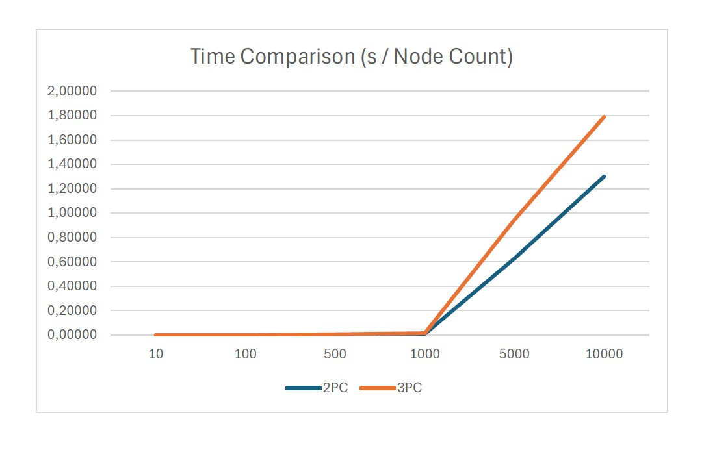

.. include:: substitutions.rst

Implementation, Results and Discussion
======================================

Implementation and Methodology
~~~~~~~~~~~~~~~~~~~~~~~~~~~~~~~~~~~~

Within distributed systems, the Three-Phase Commit Protocol (3PC) stands as a fundamental mechanism ensuring transactional integrity across networked environments. This chapter aims to delve into the methodology and implementation intricacies essential for comprehending the operational dynamics and practical implications of integrating the 3PC protocol within the AdHocComputing Python library.

At the core of the 3PC protocol lies a sophisticated mechanism for coordinating transactional activities across distributed nodes. Spanning three distinct phases - pre-commit, commit, and abort - each phase involves meticulous communication, synchronization, and fault tolerance mechanisms. Providing insights into the protocol's message exchange patterns, failure detection algorithms, and decision-making processes is essential for understanding its resilience and effectiveness in real-world scenarios.

The efficacy of the 3PC protocol is paramount in enforcing atomicity and consistency across distributed transactions. By employing a three-phase commit strategy, the protocol ensures that all participants ultimately either commit or abort, thereby upholding the integrity of the distributed database. Elucidating the mechanisms for logging, recovery, and concurrency control sheds light on how the protocol addresses data inconsistencies and transactional anomalies within the distributed environment.

Beyond ensuring functional correctness, assessing the performance characteristics of the 3PC protocol is vital for practical deployment. Through rigorous experimentation and benchmarking, the protocol's latency, throughput, and scalability properties are evaluated across diverse workloads and network conditions. Detailed performance metrics, including commit latency and resource utilization, offer valuable insights into the protocol's operational boundaries and scalability thresholds.

In summary, a comprehensive understanding of the Three-Phase Commit Protocol within the AdHocComputing Python library encompasses not only its theoretical underpinnings but also its practical implementation considerations and performance implications. By exploring its methodology, implementation details, and performance characteristics, practitioners can effectively leverage the 3PC protocol to ensure transactional integrity and scalability in distributed systems.

Results
~~~~~~~~
The three-phase commit protocol is an extension of the two-phase commit protocol, designed to address some of its limitations while still ensuring distributed transactional consistency. Like its predecessor, the three-phase commit protocol aims to achieve ACID properties (Atomicity, Consistency, Isolation, Durability) across distributed systems.

In the first phase, the coordinator node sends a prepare request to all participating nodes. Unlike the two-phase commit, this phase introduces an additional "pre-commit" step, where the participants acknowledge their readiness to commit, abort, or remain undecided. This phase helps mitigate some of the blocking issues that can occur in the two-phase commit protocol.

In the second phase, upon receiving acknowledgments from all participants, the coordinator decides whether to commit or abort the transaction. If all participants are prepared to commit, the coordinator sends a commit message to all nodes. Conversely, if any participant aborts or if there's a timeout, the coordinator sends an abort message to all nodes, ensuring transactional consistency.

The three-phase commit protocol adds a third phase, the "commit" phase. After sending the commit message, the coordinator waits for acknowledgments from all participants confirming the successful commit. This phase enhances fault tolerance and ensures that the commit decision is finalized across all nodes, even if there are transient network failures or node crashes.

Despite its advantages, the three-phase commit protocol introduces additional complexity and communication overhead compared to the two-phase commit. The coordination required across multiple phases can impact performance and scalability, particularly in large-scale distributed systems. Additionally, the protocol may still suffer from blocking if any participant fails or becomes unresponsive during the commit phase.

In practice, the three-phase commit protocol strikes a balance between ensuring robust distributed transactional consistency and managing the associated complexities and overhead. Its additional phase provides enhanced fault tolerance and reliability, making it a suitable choice for applications where data integrity is crucial. However, it's essential to evaluate the trade-offs carefully, considering factors such as system scalability, performance requirements, and the potential impact of network failures or participant unresponsiveness. While the protocol offers advantages over its predecessor, its adoption should be guided by a thorough understanding of the specific requirements and constraints of the distributed system in question.

The simulation results shows that as the number of nodes increases, the running time of the algorithm also increases like its predecessors. Also, simulation shows that since 3PC protocol includes more messaging between nodes, according to 2PC protocol run time is higher.

    Simulation result for Three-Phase Commit Protocol

Discussion
~~~~~~~~~~

One of the pivotal strengths of the Three-Phase Commit (3PC) protocol lies in its adeptness at orchestrating distributed transactions across multiple participants, thereby assuring atomicity even amidst failures. However, notwithstanding its efficacy in upholding consistency, 3PC harbors its own set of constraints. The protocol's intrinsic blocking nature during the commit phase, coupled with the potential for indefinite blocking in case of failures, poses formidable challenges concerning scalability and fault tolerance. Moreover, the reliance on synchronous communication among the coordinator and participants can engender latency, thereby impeding overall system performance. This discourse enhances our comprehension of 3PC and lays the groundwork for further innovations in distributed transaction management protocols.