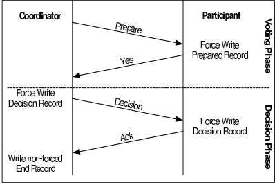

.. include:: substitutions.rst

|DistAlgName|
=========================================

Background and Related Work
~~~~~~~~~~~~~~~~~~~~~~~~~~~~~~

The Two-Phase Commit Protocol (2PC) is a fundamental algorithm used in distributed systems to achieve atomicity of transactions across multiple nodes. It ensures that either all nodes commit to a transaction or none do, thus maintaining data consistency.
The original two-phase commit protocol (2PC) is due to [Gray1978]_.
Without loss of generality, consider a distributed transaction involving the
participation of a number of processes, each running on a different machine.
Assuming that no failures occur, the protocol consists of two
phases, each consisting of two steps [BernsteinNewcomer2009]_:

Distributed Algorithm: |DistAlgName| 
~~~~~~~~~~~~~~~~~~~~~~~~~~~~~~~~~~~~~~~~~~~~~~~~~~~~~~~~~~~~~~~~~~~~~~~~~~~~~~~~~~~~~~~~~~~~~~~~~~~~~~~

A key component of distributed systems is the two-phase commit protocol (2PC) :ref:`Algorithm <2PCProtocol>`, which coordinates transactions among several nodes to guarantee atomicity and consistency. Its importance originates from its capacity to consistently coordinate distributed transactions, which prevents inconsistencies and maintains data integrity. This section explores into each aspect of the two-phase commit protocol, clarifying its underlying concepts and practical details. We explore the specifics of its implementation and how it enables distributed participants to make coordinated decisions. In addition, we perform a comparative study, examining the advantages and disadvantages of the two-phase commit protocol in different distributed system scenarios. We learn more about this investigation's effectiveness in maintaining transactional integrity and its suitability for use in a variety of distributed computing environments.

1. Voting Phase
        a. The coordinator sends a vote-request message to all participants.

        b. When a participant receives a vote-request message, it returns either a vote-commit message to the coordinator, telling the coordinator that it is prepared to locally commit its part of the transaction, or otherwise, a vote-abort message.

2. Decision Phase
        a. The coordinator collects all votes from the participants. If all participants have voted to commit the transaction, then so will the coordinator. In that case, it sends a global-commit message to all participants. However, if one participant had voted to abort the transaction, the coordinator will also decide to abort the transaction and multicasts a global-abort message.

        b. Each participant that voted for a commit waits for the final reaction by the coordinator. If a participant receives a global-commit message, it locally commits the transaction. Otherwise, when receiving a global-abort message, the transaction is locally aborted as well. The first phase is the voting phase, and consists of steps 1 and 2. The second phase is the decision phase, and consists of steps 3 and 4.

    .. _2PCProtocol:

    .. code-block:: RST
        :linenos:
        :caption: Two-Phase Commit Protocol Algorithm

        class Coordinator:
            def run(self):
                yetToReceive = list(self.participants)
                self.log.info(’WAIT’)
                self.chan.sendTo(self.participants, VOTE_REQUEST)
                while len(yetToReceive) > 0:
                    msg = self.chan.recvFrom(self.participants, BLOCK, TIMEOUT)
                    if msg == -1 or (msg[1] == VOTE_ABORT):
                        self.log.info(’ABORT’)
                        self.chan.sendTo(self.participants, GLOBAL_ABORT)
                        return
                    else: # msg[1] == VOTE_COMMIT
                        yetToReceive.remove(msg[0])
                        self.log.info(’COMMIT’)
                        self.chan.sendTo(self.participants, GLOBAL_COMMIT)

        class Participant:
            def run(self):
                self.log.info(’INIT’)
                msg = self.chan.recvFrom(self.coordinator, BLOCK, TIMEOUT)
                if msg == -1: # Crashed coordinator - give up entirely
                    decision = LOCAL_ABORT
                else: # Coordinator will have sent VOTE_REQUEST
                    decision = self.do_work()
                    if decision == LOCAL_ABORT:
                        self.chan.sendTo(self.coordinator, VOTE_ABORT)
                        self.log.info(’LOCAL_ABORT’)
                    else: # Ready to commit, enter READY state
                        self.log.info(’READY’)
                        self.chan.sendTo(self.coordinator, VOTE_COMMIT)
                        msg = self.chan.recvFrom(self.coordinator, BLOCK, TIMEOUT)
                        if msg == -1: # Crashed coordinator - check the others
                            self.log.info(’NEED_DECISION’)
                            self.chan.sendTo(self.participants, NEED_DECISION)
                            while True:
                                msg = self.chan.recvFromAny()
                                if msg[1] in [GLOBAL_COMMIT, GLOBAL_ABORT, LOCAL_ABORT]:
                                decision = msg[1]
                                break
                        else: # Coordinator came to a decision
                            decision = msg[1]
                    if decision == GLOBAL_COMMIT:
                        self.log.info(’COMMIT’)
                    else: # decision in [GLOBAL_ABORT, LOCAL_ABORT]:
                        self.log.info(’ABORT’)
                    while True: # Help any other participant when coordinator crashed
                        msg = self.chan.recvFrom(self.participants)
                        if msg[1] == NEED_DECISION:
                            self.chan.sendTo([msg[0]], decision)

Example
~~~~~~~~

Correctness
~~~~~~~~~~~

The Two-Phase Commit (2PC) protocol is a distributed algorithm used to ensure atomicity in distributed transactions. It ensures that all participating nodes either commit or abort a transaction in a distributed environment. Here's a brief overview of the correctness, safety, liveness, and fairness proofs for the Two-Phase Commit protocol:

1. **Correctness:**

    The correctness of the Two-Phase Commit protocol guarantees that if all nodes are functioning correctly, the protocol ensures atomicity of distributed transactions.

    Proof:
        The protocol ensures that all nodes reach a consistent decision regarding the outcome of a transaction, i.e., either commit or abort.

        By enforcing a two-phase commit process, the protocol ensures that no committed transaction is lost or left in an inconsistent state.

2. **Safety:**

    Safety ensures that certain properties hold under all circumstances, including failure scenarios.

    In Two-Phase Commit, safety guarantees that no committed transaction is lost and no inconsistent state arises.

    Proof:
        During the first phase (voting phase), all participants agree to commit only if they are sure that every other participant is ready to commit.

        In the second phase (commit phase), all participants commit only if the coordinator receives a "yes" vote from all participants.

        If any participant fails to respond or votes "no," the coordinator aborts the transaction, ensuring safety by preventing partial commits.

3. **Liveness:**

    Liveness guarantees that the system will eventually make progress, i.e., it will eventually complete transactions.

    In Two-Phase Commit, liveness ensures that the protocol eventually reaches a decision (either commit or abort) for every transaction, even in the presence of failures.

    Proof:
        The protocol employs a timeout mechanism to handle failures and ensure progress.

        If the coordinator fails during the commit phase, a new coordinator can be elected, ensuring progress and completion of transactions.

        Even in the presence of network partitions or node failures, the protocol guarantees eventual completion of transactions.

4. **Fairness:**

    Fairness ensures that all participants in the system are treated fairly, and no participant is unfairly disadvantaged.

    In Two-Phase Commit, fairness implies that all participants have an equal opportunity to participate in the decision-making process.

    Proof:
        The protocol treats all participants equally by requiring their consent before committing a transaction.

        Every participant has the opportunity to vote during the first phase and can either vote to commit or abort based on its local state.

        The protocol ensures that no participant can unilaterally force a commit without the consensus of all other participants, thus maintaining fairness.

Complexity 
~~~~~~~~~~

1. **Time Complexity**

    Voting Phase:

        In the first phase, each participant node communicates with the coordinator to signify its preparedness to commit.
        The time complexity of this phase is O(n), where n is the number of participating nodes. Each node communicates with the coordinator once.

    Decision Phase:

        In the second phase, assuming all nodes are prepared to commit, the coordinator instructs all nodes to either commit or abort.
        The time complexity of this phase is also O(n), as the coordinator communicates with each participant node once.

    The overall time complexity of the Two-Phase Commit protocol is O(n), where n is the number of participating nodes.

2. **Message Complexity:**

    Voting Phase:

        Each participant node sends a message to the coordinator indicating its readiness to commit.
        The total number of messages sent in this phase is equal to the number of participating nodes, thus O(n).

    Decision Phase:

        The coordinator sends a message to each participant node instructing them to commit or abort.
        The total number of messages sent in this phase is also equal to the number of participating nodes, thus O(n).

    The overall message complexity of the Two-Phase Commit protocol is O(n), where n is the number of participating nodes.

.. [Gray1978] Gray J. Notes on Database Operating Systems. In Bayer R., Graham R., and Seegmuller G., editors, Operating Systems: An Advanced Course, volume 60 of Lecture Notes in Computer Science, pages 393–481. Springer-Verlag, Berlin, 1978.
.. [BernsteinNewcomer2009] Bernstein P. and Newcomer E. Principles of Transaction Processing. Morgan Kaufman, San Mateo, CA., 2nd edition, 2009.