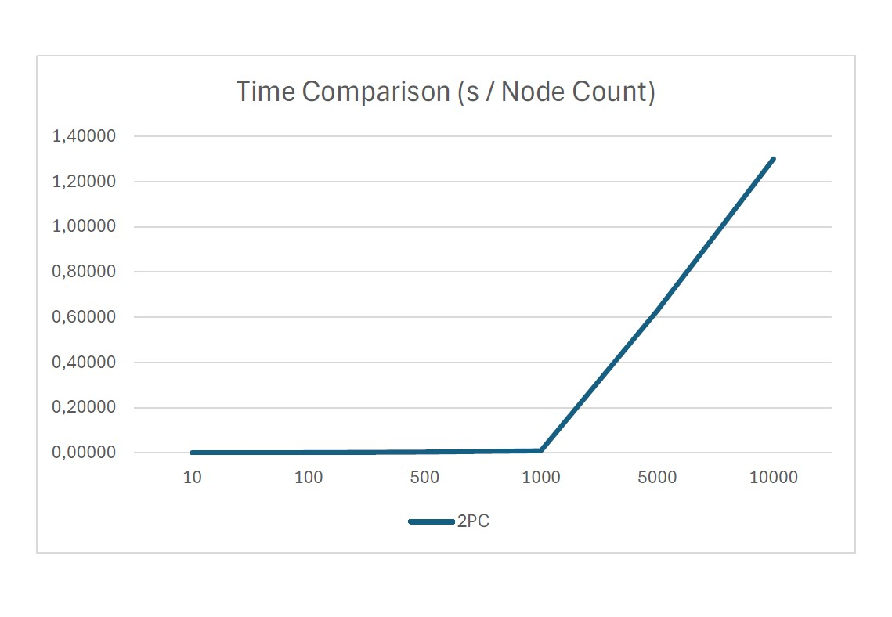

.. include:: substitutions.rst

Implementation, Results and Discussion
======================================

Implementation and Methodology
~~~~~~~~~~~~~~~~~~~~~~~~~~~~~~~~~~~~
In the realm of distributed systems, the Two-Phase Commit Protocol (2PC) serves as a cornerstone for ensuring transactional integrity across networked environments. This chapter delves into the methodology and implementation details essential for understanding the operational nuances and practical considerations of deploying the 2PC protocol within the AdHocComputing Python library.

At the heart of the 2PC protocol lies the mechanism for coordinating transactional activities across distributed nodes. From transaction initiation to commit or abort decisions, each phase entails careful communication, synchronization, and fault tolerance mechanisms. Describing the protocol's message exchange patterns, failure detection algorithms, and decision-making processes offers valuable insights into its robustness and resilience in real-world scenarios.

Central to the efficacy of the 2PC protocol is its ability to enforce atomicity and consistency across distributed transactions. By leveraging a two-phase commit strategy, the protocol ensures that all participants either commit or abort, preserving the integrity of the distributed database. Describing the mechanisms for logging, recovery, and concurrency control elucidates how the protocol mitigates data inconsistencies and transactional anomalies within the distributed environment.

In addition to functional correctness, the performance characteristics of the 2PC protocol are crucial for real-world deployment. Through rigorous experimentation and benchmarking, the protocol's latency, throughput, and scalability properties are evaluated across various workloads and network conditions. Detailed performance metrics, such as commit latency and resource utilization, provide valuable insights into the protocol's operational envelope and scalability limits.

Results
~~~~~~~~
The two-phase commit protocol ensures that all participating nodes reach a unanimous decision regarding transaction commit or rollback, thereby preserving the ACID properties (Atomicity, Consistency, Isolation, Durability) of the distributed transaction. However, it's important to note that the protocol introduces some overhead due to the need for coordination and communication between the coordinator and participants, and it can potentially suffer from blocking if any participant fails or becomes unresponsive.

Overall, the two-phase commit protocol provides a robust mechanism for achieving distributed transactional consistency, but its use should be carefully considered in scenarios where performance and scalability are critical factors.

The simulation results shows that as the number of nodes increases, the running time of the algorithm also increases. In systems where the number of participants is high, it may cause a burden due to increased communication.

    Simulation result for Two-Phase Commit Protocol

--------------------------------------------------------

Discussion
~~~~~~~~~~
One of the key strengths of the protocol lies in its ability to coordinate distributed transactions among multiple participants, guaranteeing atomicity even in the face of failures. However, despite its effectiveness in ensuring consistency, 2PC is not without its limitations. The inherent blocking nature of the protocol during the commit phase, coupled with the potential for blocking indefinitely in case of failures, poses challenges in terms of scalability and fault tolerance. Furthermore, the reliance on synchronous communication between the coordinator and participants can introduce latency, impacting overall system performance. This discussion contributes to a deeper understanding of 2PC and paves the way for further advancements in distributed transaction management protocols.
